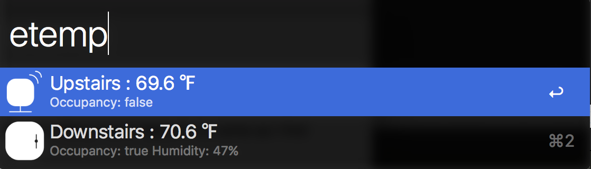
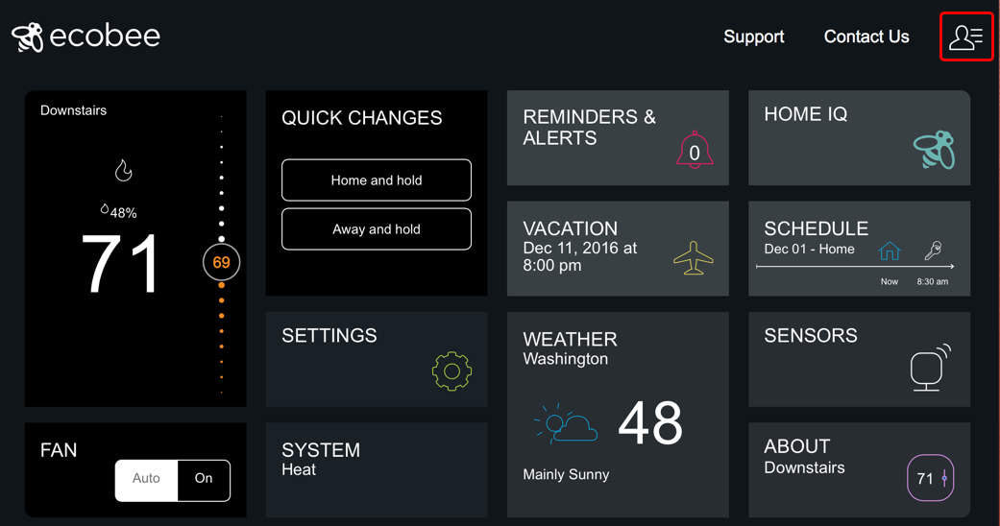
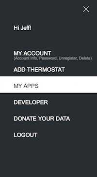
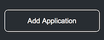
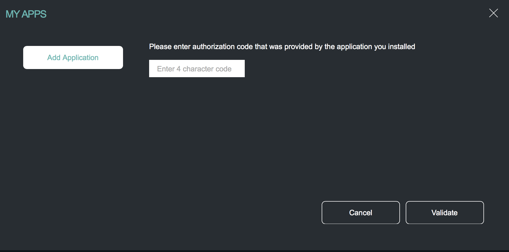
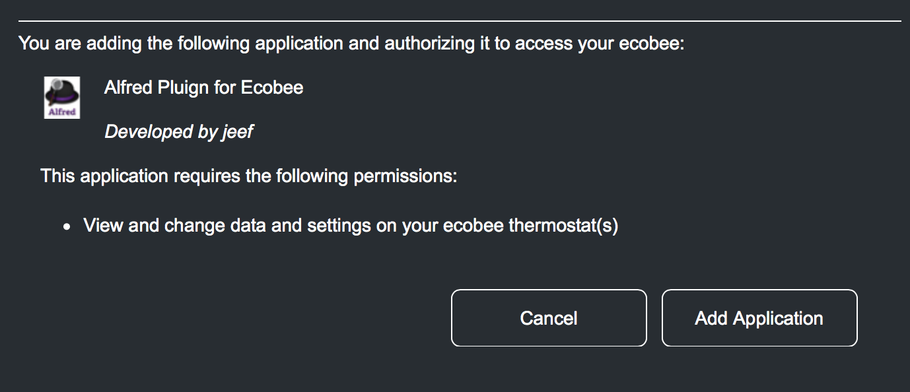

# Alfred Ecobee Plugin (YEA!)

As of the time of writing all this plugin will do is display your ecobee sensors.  Many future features to come as I find time to work on the plugin

# Authorizing the Plugin

In order to use this plugin with your ecobee you will need to authorize it to communicate with your ecobee account.  You do this by first generating an authorization pin.  Once you've generated this pin you have 10 minutes to authorize the application or the pin will time out.

### Step 1

Log into your ecobee account and select the upper right menu

### Step 2
Select **My Apps**
from the menu

### Step 3
Click the **Add Application** button to add a new application

### Step 4

You will now be prompted to enter the **PIN** that was generated by the authorization process.  Once you have done this select the **Validate** button

### Step 5

Once the application is validated and you can verify you are granting access to this alfred plugin you can select **Add Application**

The Alfred plugin will continue to check in the background every 5 seconds to see whether you have validated the application.  Once the plugin detects the validation was successful it will give you a message via a notification.

# Reauthorizing the plugin

Its possible that when  you reauthorize you may need to delete the application from my apps before you can re-add it.  